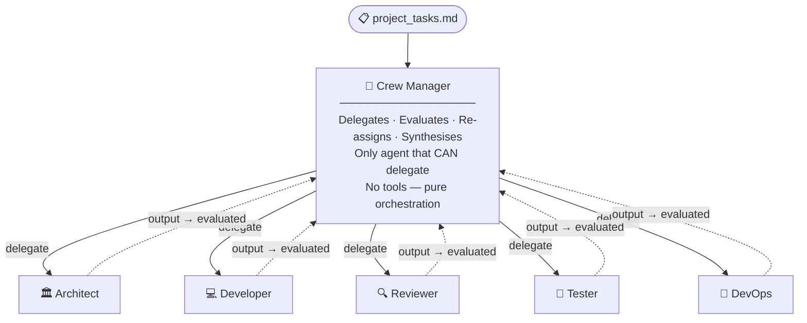

# Agents Reference

DreamTeam runs **five specialised agents** plus an invisible **Crew Manager**
that orchestrates all of them. This document describes every role in detail.

---

## The Crew Manager

The Manager is the most important piece of the agency — but it has no file of
its own because CrewAI instantiates it internally when `Process.hierarchical`
is used.

### What it does



The Manager:
1. **Reads the task list** and the outputs produced so far
2. **Delegates** each task to the most appropriate agent
3. **Evaluates** the agent's output — if it's incomplete or wrong, it sends it back
4. **Re-assigns** tasks between agents if one gets stuck
5. **Synthesises** the final deliverable once all tasks are complete

The Manager is the **only agent that can delegate**. All other agents have
`allow_delegation=False` and only work on what they are given.

### The Manager has no tools

Unlike all other agents, the Manager carries **no crewai_tools, skill packs,
or MCP tools**. It is a pure reasoning and orchestration layer. This is by
design — the Manager spends its token budget on planning and evaluation,
not on searching the web or reading files.

### Which model to use for the Manager

Because the Manager orchestrates complex multi-step reasoning over long
output histories, it benefits more from **reasoning depth** than speed.

| Model | Why it works |
|---|---|
| `claude-3-5-sonnet-20241022` ✦ | Best instruction-following + long context |
| `claude-3-opus-20240229` | Deepest reasoning, highest cost |
| `gpt-4o` | Strong at structured delegation |
| `gemini-1.5-pro` | 1M token context; good for large codebases |
| `llama3.1:70b` | Best local option |
| `llama3.1:8b` | Adequate for smaller tasks |
| `mistral:7b` | Minimum viable; may lose track on complex flows |

✦ Default in the `BALANCED` profile.

> **Tip:** If the crew gets stuck in loops or produces off-target output,
> upgrade the Manager model first — it has the most leverage on output quality.

### Configuring the Manager

The Manager model comes from `PROFILE.manager` in `agency.py`:

```python
# agency.py
from config.profiles import BALANCED
PROFILE = BALANCED
# PROFILE.manager == "claude-3-5-sonnet-20241022"
```

To use a different model just for the manager without changing the whole profile:

```python
from config.profiles import BALANCED, AgencyProfile
from dataclasses import replace

PROFILE = replace(BALANCED, manager="claude-3-opus-20240229")
```

The Manager temperature defaults to `0.2` (slightly creative, not deterministic).
Override it:

```python
from config.profiles import BALANCED, AgencyProfile
from dataclasses import replace

PROFILE = replace(BALANCED, temperatures={"manager": 0.0})  # fully deterministic
```

---

## Agent 1 — Solution Architect

| Attribute | Value |
|---|---|
| **File** | `agents/architect.py` |
| **Default model** | `gemini-1.5-flash` (BALANCED) |
| **Temperature** | 0.2 |
| **Delegates?** | ✗ No |
| **Produces** | Implementation plan (Markdown) |

### Responsibilities
- Traverses the entire source directory before planning
- Queries official documentation for library APIs, RFCs, and patterns
- Produces a **file-level technical implementation plan** that includes:
  - Files to create / modify / delete
  - Function signatures and data model changes
  - Dependency additions and version constraints
  - Edge cases and backward-compatibility considerations

### Base tools
`DirectoryReadTool`, `FileReadTool`, `SerperDevTool`, `ScrapeWebsiteTool`,
`GithubSearchTool`, `CodeDocsSearchTool`, `JSONSearchTool`, `TXTSearchTool`, `XMLSearchTool`

### Recommended skill packs
`CLOUD_AWS`, `CLOUD_GCP`, `CLOUD_AZURE`, `API`, `GRAPHQL`

### MCP augmentation
GitHub MCP (reference implementations), Brave Search MCP (research)

---

## Agent 2 — Senior Software Engineer

| Attribute | Value |
|---|---|
| **File** | `agents/developer.py` |
| **Default model** | `gpt-4o` (BALANCED) |
| **Temperature** | 0.1 |
| **Delegates?** | ✗ No |
| **Produces** | Source files written to `SOURCE_DIRECTORY` |

### Responsibilities
- Reads **all relevant existing files** before making any changes
- Implements the Architect's plan exactly — no scope creep
- Writes clean, type-hinted, documented code following SOLID principles
- Preserves existing test contracts and public APIs

### Base tools
`DirectoryReadTool`, `FileReadTool`, `FileWriterTool`,
`CodeDocsSearchTool`, `SerperDevTool`, `JSONSearchTool`, `TXTSearchTool`

### Recommended skill packs
`PYTHON`, `JAVA`, `KOTLIN`, `NODEJS`, `TYPESCRIPT`, `RUST`, `GO`, `DATABASE`, `NOSQL`, `API`

### MCP augmentation
GitHub MCP (library examples), Filesystem MCP (bulk traversal)

---

## Agent 3 — Principal Code Reviewer

| Attribute | Value |
|---|---|
| **File** | `agents/reviewer.py` |
| **Default model** | `claude-3-5-sonnet-20241022` (BALANCED) |
| **Temperature** | 0.1 |
| **Delegates?** | ✗ No |
| **Produces** | `review_report.md` — PASS/FAIL verdict + findings |

### Responsibilities
- Compares the developer's output against the original task list
- Scans for security vulnerabilities (OWASP Top 10), hardcoded secrets, and
  missing input validation
- Checks code style matches existing conventions
- Verifies every task item is implemented — no omissions
- Only issues PASS when code is genuinely production-ready

### Base tools
`DirectoryReadTool`, `FileReadTool`, `FileWriterTool`,
`SerperDevTool`, `CodeDocsSearchTool`, `JSONSearchTool`, `TXTSearchTool`

### Recommended skill packs
`SECURITY`, `API`, `DATABASE`

### MCP augmentation
GitHub MCP (PR history, upstream issues), Brave Search MCP (CVE lookups)

---

## Agent 4 — QA Automation Engineer

| Attribute | Value |
|---|---|
| **File** | `agents/tester.py` |
| **Default model** | `gpt-4o-mini` (BALANCED) |
| **Temperature** | 0.1 |
| **Delegates?** | ✗ No |
| **Produces** | PyTest suite written to `SOURCE_DIRECTORY/tests/` |

### Responsibilities
- Reads source files to derive exact test cases (no guessing)
- Writes tests for: happy paths, edge cases, boundary conditions, expected exceptions
- Follows the test pyramid: many unit tests, fewer integration tests
- Uses fixtures and `@pytest.mark.parametrize` for clean, DRY suites

### Base tools
`DirectoryReadTool`, `FileReadTool`, `FileWriterTool`, `SerperDevTool`

### Recommended skill packs
`TESTING`, `PYTHON`, `JAVA`

### MCP augmentation
GitHub MCP (test patterns from similar open-source projects)

---

## Agent 5 — Cloud DevOps Specialist

| Attribute | Value |
|---|---|
| **File** | `agents/devops.py` |
| **Default model** | `gpt-4o-mini` (BALANCED) |
| **Temperature** | 0.2 |
| **Delegates?** | ✗ No |
| **Produces** | `Dockerfile`, `docker-compose.yml`, `.github/workflows/deploy.yml` |

### Responsibilities
- Writes a minimal, multi-stage Dockerfile
- Creates a `docker-compose.yml` for local development
- Builds a complete CI/CD pipeline (GitHub Actions / Azure DevOps)
- Injects all secrets via environment variables (never hardcoded)
- Adds health checks, liveness probes, and rollback strategies

### Base tools
`DirectoryReadTool`, `FileReadTool`, `FileWriterTool`,
`TXTSearchTool`, `XMLSearchTool`, `JSONSearchTool`,
`SerperDevTool`, `ScrapeWebsiteTool`

### Recommended skill packs
`CLOUD_AWS`, `CLOUD_GCP`, `CLOUD_AZURE`, `DATABASE`

### MCP augmentation
Brave Search MCP (cloud docs, security bulletins), Filesystem MCP (monorepo traversal)

---

## All agents at a glance

| Agent | Role | Model (BALANCED) | Temperature | Output |
|---|---|---|---|---|
| **Manager** | Orchestrator | claude-3-5-sonnet | 0.2 | Crew coordination |
| **Architect** | Planner | gemini-1.5-flash | 0.2 | Implementation plan |
| **Developer** | Coder | gpt-4o | 0.1 | Source files |
| **Reviewer** | QA Guardian | claude-3-5-sonnet | 0.1 | review_report.md |
| **Tester** | Automation | gpt-4o-mini | 0.1 | Test suite |
| **DevOps** | Deployment | gpt-4o-mini | 0.2 | Dockerfile + CI/CD |

---

## Adding a new agent

See **[extending.md](extending.md#adding-a-custom-agent)** for a step-by-step example.
