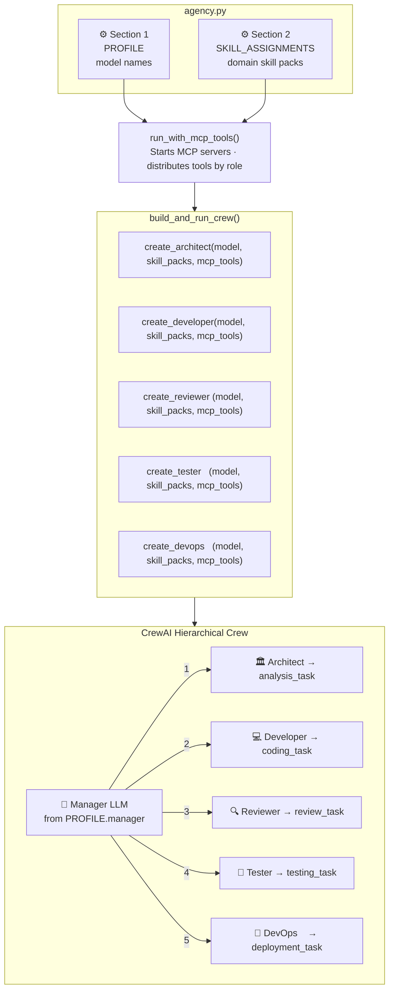
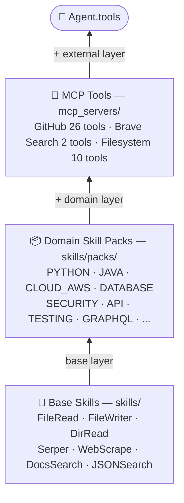
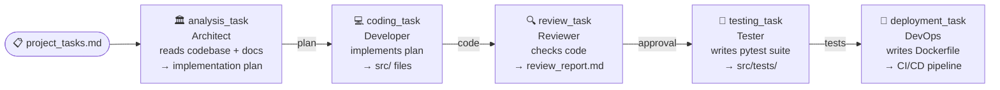
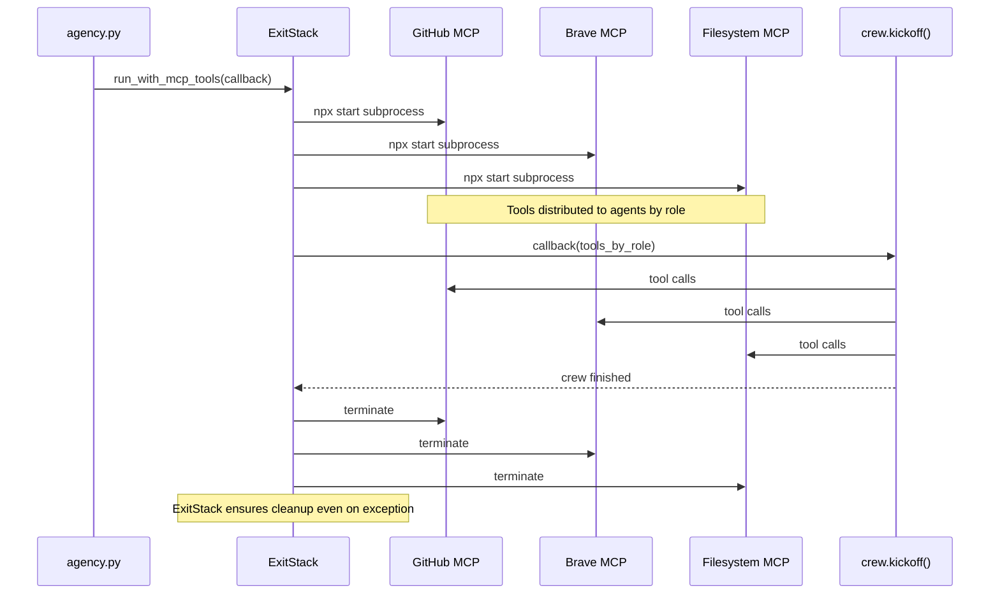
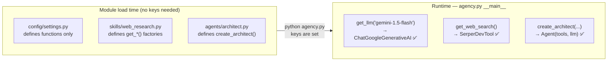

# Architecture

System design and data flow for the DreamTeam multi-agent agency.

---

## High-level overview

---

## Agent tool stack

Each agent receives three layers of tools, merged at construction time:

> `Agent.tools = [base skills] + [skill pack tools] + [MCP tools]`

---

## Task pipeline

Tasks run **sequentially**. Each task's output becomes context for the next.

---

## MCP server lifecycle

---

## Lazy initialisation pattern

All LLMs and embedding-based tools in DreamTeam are constructed **lazily**
(only when `agency.py` actually runs), not at module import time.

This means you can `import` any module without having API keys set —
useful for testing, CI lint checks, and IDEs.

---

## Key design decisions

| Decision | Rationale |
|---|---|
| **Factory functions for agents** | Agents need LLMs + tools at runtime. Factories delay construction, enabling lazy credentials and flexible injection. |
| **`run_with_mcp_tools(callback)`** | MCP subprocesses must be alive while the crew runs. The callback pattern enforces this without requiring nested `with` blocks in `agency.py`. |
| **Folder named `mcp_servers/` not `mcp/`** | Avoids shadowing the `mcp` pip package. |
| **All tool getters are lazy** | `crewai_tools` RAG-based tools and GithubSearchTool validate credentials at construction time. Lazy getters prevent import-time failures. |
| **SkillPack `tools_factory` is callable** | Prevents tools from being instantiated at module load. Tools are only built when `pack.get_tools()` is called inside an agent factory. |
| **Profile temperatures** | Different tasks have different creativity needs. Planning (0.2) benefits from slight creativity; coding and review (0.1) should be deterministic. |
