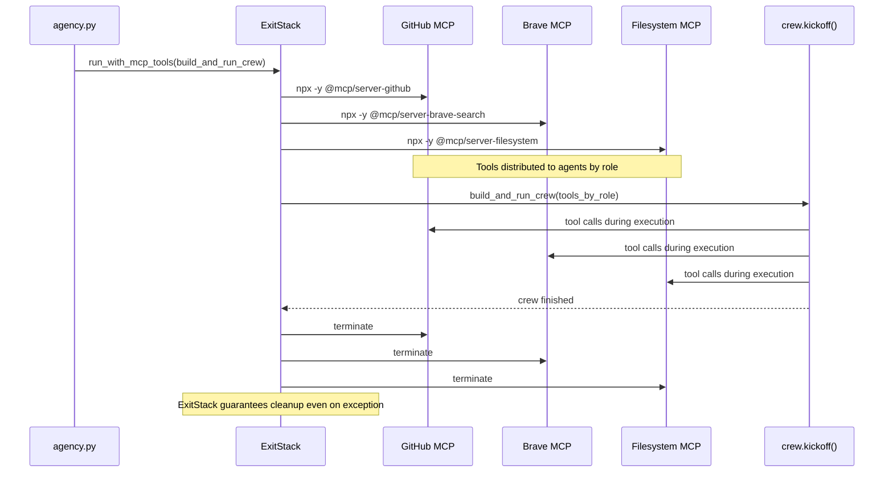

# MCP Servers

DreamTeam integrates three **Model Context Protocol (MCP)** servers that run
as external Node.js subprocesses. They give agents real tool access beyond
what the built-in `crewai_tools` package provides.

---

## Overview

| Server | npm package | Key capabilities | Agents |
|---|---|---|---|
| **GitHub** | `@modelcontextprotocol/server-github` | Search code, read files, list commits, create PRs, manage issues | Architect, Developer, Reviewer, Tester |
| **Brave Search** | `@modelcontextprotocol/server-brave-search` | Privacy-respecting web & local search | Architect, Reviewer, DevOps |
| **Filesystem** | `@modelcontextprotocol/server-filesystem` | Directory tree, read multiple files, search files, edit files | Developer, DevOps |

MCP servers are **optional**. If a server fails to start (missing Node.js,
bad API key), the agency logs a ⚠️ warning and continues without it.

---

## Prerequisites

**Node.js ≥ 18** is required to run MCP servers.

```bash
# Check version
node --version    # v18.x.x or higher

# Install on macOS with Homebrew
brew install node

# Install with nvm (any OS)
curl -o- https://raw.githubusercontent.com/nvm-sh/nvm/v0.39.7/install.sh | bash
nvm install 18 && nvm use 18
```

The npm packages are downloaded automatically on first run via `npx -y`
(~10 MB, cached after first download).

---

## GitHub MCP

Provides: `list_repos`, `get_file_contents`, `create_or_update_file`,
`search_repositories`, `search_code`, `search_issues`, `create_pull_request`,
`get_issue`, `list_commits`, and more.

### Setup

1. Go to <https://github.com/settings/tokens>
2. Click **Generate new token (classic)**
3. Select scopes: `repo`, `read:user`
4. Copy the token

```bash
export GITHUB_TOKEN=ghp_...
```

### What it unlocks for each agent

| Agent | GitHub MCP usage |
|---|---|
| **Architect** | Search GitHub for reference implementations of the required pattern |
| **Developer** | Read library source code, look up open bugs, find usage examples |
| **Reviewer** | Check if similar code has known issues in upstream repos |
| **Tester** | Find test patterns used in similar open-source projects |

---

## Brave Search MCP

Provides: `brave_web_search` (general web), `brave_local_search` (local POIs).

### Setup

1. Go to <https://brave.com/search/api/>
2. Sign up — the **free tier** gives 2,000 queries/month
3. Copy your API key

```bash
export BRAVE_API_KEY=BSA...
```

### What it unlocks

| Agent | Brave Search usage |
|---|---|
| **Architect** | Research library trade-offs, architecture patterns, RFCs |
| **Reviewer** | Look up CVEs, security advisories, OWASP guidance |
| **DevOps** | Check cloud provider changelogs and security bulletins |

---

## Filesystem MCP

Provides: `read_file`, `read_multiple_files`, `write_file`, `edit_file`,
`create_directory`, `list_directory`, `directory_tree`, `move_file`,
`search_files`, `get_file_info`.

### Setup

No API key required. The server is restricted to the current working directory
for safety (the `"."` argument in `mcp_servers/servers.py`).

```bash
# No env var needed — just Node.js ≥ 18
```

### What it unlocks

| Agent | Filesystem MCP usage |
|---|---|
| **Developer** | Bulk file traversal, read multiple files in one call, atomic edits |
| **DevOps** | Scan monorepo structure, verify generated files, move artefacts |

---

## Lifecycle management

MCP servers are started and stopped automatically by `run_with_mcp_tools()` in
`mcp_servers/adapters.py`. The lifecycle is:



This ensures subprocesses are always cleaned up, even if the crew raises an exception.


---

## Tool-role distribution

```python
# mcp_servers/adapters.py
tools_by_role = {
    "architect": [*github_tools, *brave_tools],
    "developer": [*github_tools, *fs_tools],
    "reviewer":  [*github_tools, *brave_tools],
    "tester":    [*github_tools],
    "devops":    [*brave_tools, *fs_tools],
}
```

To change which MCP tools go to which agent, edit this dict in `adapters.py`.

---

## Adding a new MCP server

1. Define the server parameters in `mcp_servers/servers.py`:

```python
from mcp import StdioServerParameters

MY_SERVER = StdioServerParameters(
    command="npx",
    args=["-y", "@modelcontextprotocol/server-my-server"],
    env={**os.environ, "MY_API_KEY": os.getenv("MY_API_KEY", "")},
)
```

2. Add it to `mcp_servers/adapters.py`:

```python
from mcp_servers.servers import ..., MY_SERVER

def run_with_mcp_tools(callback):
    ...
    with ExitStack() as stack:
        ...
        my_tools = _safe_attach(stack, MY_SERVER, "My Server MCP  ")

        tools_by_role = {
            "developer": [*github_tools, *fs_tools, *my_tools],
            ...
        }
```

---

## Troubleshooting

### `⚠️ GitHub MCP: skipped — ...`
- Check `GITHUB_TOKEN` is set: `echo $GITHUB_TOKEN`
- Verify the token has `repo` scope
- Confirm Node.js ≥ 18: `node --version`

### MCP server takes a long time to start
First run downloads the npm package. Subsequent runs use the npm cache and start in < 2 s.

### `EACCES: permission denied` on npm cache
```bash
mkdir -p ~/.npm
chmod 755 ~/.npm
```

### Disabling a specific MCP server
Comment out the `_safe_attach` call for that server in `mcp_servers/adapters.py`.
The agency will run with the remaining servers.
